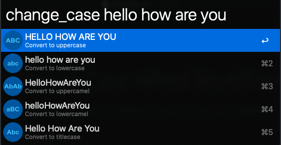

# Change Case Alfred Workflow

This Alfred workflow helps to change the case of the text in the clipboard or any optional text typed as arguments.

## Usage:

'change_case' then select desired format. 

Example results below:

